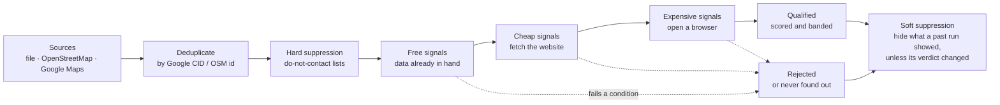

<div align="center">

# Kerb

**Find local businesses worth contacting, and see the evidence behind every verdict.**

Kerb takes business listings from a file you already have, OpenStreetMap or Google Maps.
It runs the checks you choose and sorts every business into **qualified**, **rejected** or
**never found out**, which is what it reports when it could not take a measurement.

[](LICENSE)
[](https://www.python.org/downloads/)
[](tests/)
[](pyproject.toml)
[](#legal-and-responsible-use)


</div>

---

Every Maps scraper hands you a spreadsheet. You still have to spend the afternoon
working out which of the 400 rows are worth a phone call:
- which ones are actually in the trade;
- which closed in 2023;
- which are branches of a chain that already has an agency.

Kerb writes that afternoon down as a specification (a **campaign**, or **brief**) and
runs it in seconds. It keeps the reasoning: each score comes with the measurements that
produced it, on the row, before you click anything.

```
  96.7  Islington Family Dentist    open · dentist · no website          142 reviews
  94.7  The Chelsea Practice        open · dentist · booking page only    88 reviews
  93.3  Bright Smile Dental         open · dentist · no website           64 reviews
```

## Three outcomes, not two

Most tools have two buckets: it matched, or it didn't. That leaves something out. A
website check that *timed out* is not the same as a business with no website. Treat them
as the same and you will call people on the strength of a network error.

| Outcome | What it means | What Kerb shows you |
|---|---|---|
| **Qualified** | Measured, and passes every condition you set | The score, and every signal that contributed to it |
| **Rejected** | Measured, and fails at least one condition | **Which** condition, and the value that failed it |
| **Never found out** (`unevaluated`) | Kerb could not take the measurement | Said plainly, in its own tab. It never counts as a rejection |

A failed measurement is never treated as a verdict about a business. Kerb would rather
tell you it doesn't know than quietly make something up.

---

## Contents

- [Features](#features)
- [Install](#install)
- [Quick start](#quick-start)
- [How it works](#how-it-works)
- [Sources](#sources)
- [Signals](#signals)
- [Writing a campaign](#writing-a-campaign)
- [Trade packs and typed trades](#trade-packs-and-typed-trades)
- [Results: exports, re-ranking, re-judging](#results-exports-re-ranking-re-judging)
- [Long and repeated runs](#long-and-repeated-runs)
- [Reviews (opt-in)](#reviews-opt-in)
- [The web UI and HTTP API](#the-web-ui-and-http-api)
- [Command reference](#command-reference)
- [Configuration](#configuration)
- [Staying polite and unblocked](#staying-polite-and-unblocked)
- [Limitations](#limitations)
- [Project layout](#project-layout)
- [Contributing](#contributing)
- [Legal and responsible use](#legal-and-responsible-use)

---

## Features

- **Three sources.**
  - Import any CSV, JSON or JSONL export. Exports from gosom, Apify and Outscraper are
    recognised automatically.
  - OpenStreetMap: free, openly licensed data under the ODbL, and the default source.
  - Google Maps: no API key needed, but read [Legal](#legal-and-responsible-use) first.
- **15 signals in three cost tiers.**
  - Free signals read the data already in hand.
  - Cheap signals fetch the business's website; expensive ones open a browser.
  - Paid tiers run only when your campaign names them, and only for businesses that
    passed every cheaper condition.
- **Evidence on every measurement.** Each one records a value, a confidence from 0 to 1,
  and the evidence behind it. All three are kept with the result.
- **Filters and scoring you control.**
  - Filters use nine operators.
  - Weights can be flat, per value, or scaled (linear or log). They can also be inverted
    and weighted by confidence.
  - Score bands turn a number into a label such as "call today".
- **Re-rank without re-collecting.** The UI's sliders and the `rescore` endpoint work on
  measurements you already have. `kerb requalify` re-judges a stored run under new rules
  without fetching anything.
- **Memory between runs.**
  - Do-not-contact lists are applied before anything is measured.
  - "Seen last week" hides a business only if its verdict hasn't changed.
- **Built for long runs.**
  - Durable mode survives `kill -9` and resumes where it stopped.
  - Budgets cap results, requests and runtime.
  - A failure-rate breaker stops a run that has gone bad.
  - After a block, a cooldown is saved to disk so the next run waits it out.
- **Three ways in.** A web UI, an HTTP API (FastAPI, with OpenAPI docs) and a CLI. The
  UI's **Copy as YAML** gives you the exact file `kerb run` executes.
- **Local only.** No account, no telemetry. State lives in `~/.kerb`.

---

## Install

Kerb needs **Python 3.9 or newer**.

> **Install from GitHub, not PyPI.** The `kerb` package on PyPI is an unrelated project.

```bash
pip install "kerb[server] @ git+https://github.com/StartrekI/Kerb.git"
kerb doctor
```

```
kerb doctor v0.1.0

  ok   python                     3.11.15 (need 3.9+)
  ok   yaml                       6.0.3
  ok   httpx                      0.28.1
  ok   web UI                     fastapi, uvicorn, pydantic
  ok   packs                      14 loaded
  ok   signals                    15 registered
  ok   sources                    csv, gmaps, overpass
  --   google maps profile        not set up -- run `kerb setup` (only needed for the gmaps source)
  ok   no leftover processes      clean

  healthy
```

The core has two dependencies, `httpx` and `PyYAML`. Everything else is an optional extra:

| Extra | Adds | Needed for |
|---|---|---|
| *(none)* | `httpx`, `PyYAML` | `kerb run`, `kerb estimate`, every source, every signal except `reviews_live` |
| `server` | `fastapi`, `uvicorn`, `pydantic` | The web UI and HTTP API (`kerb`, `kerb serve`) |
| `browser` | `selenium`, plus Chrome or Chromium installed | `kerb reviews` and the `reviews_live` signal |
| `dev` | `pytest` | Running the test suite |

To work on Kerb itself, install from a clone:

```bash
git clone https://github.com/StartrekI/Kerb && cd Kerb
python3 -m venv .venv && . .venv/bin/activate
pip install -e ".[server,dev]"
```

---

## Quick start

### 1. Offline, in ten seconds

The repository ships an example campaign and a ten-row export, so the first run touches
no network at all:

```bash
kerb estimate examples/dentists-from-csv.yaml     # what it would do, without doing it
kerb run examples/dentists-from-csv.yaml --out leads.csv
```

```
dentists-no-website - Qualify an existing gosom export. No scraping — this reads data you already
  + Bright Smile Dental                      90.6
  + The Chelsea Practice                     84.5
  + Smile Studio Notting Hill                77.7
  + Shuttered Dental Rooms                   86.3
  + Islington Family Dentist                 95.4

  10 found, 10 unique, 5 qualified
    web_presence     rejected 2
    trade_match      rejected 2
    reviews          rejected 1
  -> leads.csv (5 rows, csv)
```

`leads.csv` is written best first. Add `--include-rejected` to keep the other five, each
with the condition it failed and why. Three of them:

```
Kensington Dental Lab   rejected  trade_match is False, needs != False
Mayfair Orthodontics    rejected  web_presence is 'owned_domain', needs in ['none', 'booking_only', 'social_only']
Old Town Dental         rejected  reviews is 12, needs >= 30
```

### 2. The web UI

```bash
kerb            # the same as `kerb serve`; opens http://127.0.0.1:8000
```

Pick a source, a trade and your conditions, then press **Run**. **Copy as YAML** turns
what you built into a campaign file for `kerb run`, cron or CI.

| | |
|---|---|
| <br>**Home**: what Kerb does, the five steps every business goes through, and your recent runs. | <br>**Brief**: every condition, generated from the signal registry, read back to you as a sentence. |
| <br>**Run**: a live log, and a step-by-step progress list that says *skipped · none enabled* for tiers that never ran. | <br>**Findings**: the evidence on each row, a funnel, a score distribution, and sliders that re-rank without re-running. |

### 3. OpenStreetMap: free data, no setup

```bash
kerb run examples/roofers-openstreetmap.yaml --out roofers.csv
```

This geocodes each place, asks Overpass for the trade's OSM tags, and qualifies what
comes back. The © OpenStreetMap attribution the licence requires travels with the export.

### 4. Google Maps

```bash
kerb setup --gl uk                                # once: builds a browsing profile
kerb run examples/cafes-google-maps.yaml --out cafes.csv
```

Read [Google Maps](#google-maps) and [Legal](#legal-and-responsible-use) before you do.

---

## How it works



Every business goes through the same steps:

1. **Discover.** Each source yields businesses as it finds them. They are deduplicated on
   the listing's own identity: a business found in two overlapping places appears once,
   and so does one collected from Google Maps that is also in your Google-based export.
   OpenStreetMap and Google use different ids, so the same shop from both appears twice.
2. **Measure, cheapest first.** After each cost tier, Kerb tests your conditions against
   what has been measured *so far*. It stops the moment a business fails one, so most
   businesses never reach a paid tier. A condition on a tier that hasn't run yet waits
   for that tier.
3. **Judge.** If a measurement could not be taken, the business is *never found out*,
   not rejected: a website that timed out, a count the source doesn't carry, a browser
   that failed.
4. **Score.** Qualified businesses are scored from your weights, normalised to 100 by
   default, and optionally labelled with a band.

Each measurement is a `(value, confidence, evidence)` triple, and all three are kept with
the result. This is *The Chelsea Practice* from the quick start, as the evidence drawer
shows it:

```
web_presence   booking_only   conf 1.00   +32.0   host: vagaro.com · pack: web-presence/booking-hosts@1
reviews        88             conf 1.00   +27.5   claimed: 88
trade_match    dentist        conf 0.95   +25.0   matched_category: Dental clinic · pack: trades/dentist@1
```

And a rejection names the rule that caught it:

```
Kensington Dental Lab   trade_match is False   reason: vetoed category · matched_veto: dental laboratory
```

A finished run ends in one of these states:

| Status | Meaning |
|---|---|
| `done` | Finished, and every place and source was read |
| `partial` | Finished, but a source failed, a place could not be read, or a budget or breaker cut it short. You did **not** see everything |
| `stopped` | You stopped it |
| `failed` | It could not run. The reason is kept with the run |
| `interrupted` | The server went away mid-run. Durable runs can be resumed |

A place that was read and held nothing is *not* a failure. A village with no roofer is a
complete answer, and it is listed separately as an empty place.

---

## Sources

| Source | `id` | Takes | What it provides | Cannot measure |
|---|---|---|---|---|
| **Import a file** | `csv` | `options.path` | Whatever your export carries | Depends on the file |
| **OpenStreetMap** *(default)* | `overpass` | places | Name, category, address, phone, website, opening hours, coordinates | `reviews`, `review_velocity`, `establishment_age`, `reviews_live` |
| **Google Maps** | `gmaps` | places | Name, category, address, phone, website, rating, coordinates, Google CID | `reviews`, `review_velocity`, `establishment_age` |

The UI knows what each source cannot measure. If a condition asks for one of those
signals, it warns you and holds the run rather than sending every business to *never
found out*. For Google Maps it offers `rating_band` in place of `reviews` with one click.

### Importing a file

```yaml
sources: [{id: csv, options: {path: exported.csv}}]
```

- **Formats:**
  - CSV, including Excel's byte-order mark, CRLF line endings, quoted newlines and mixed
    encodings;
  - JSON, as an array or a wrapped document;
  - JSONL.

  Files are streamed rather than loaded whole, and one malformed row costs that row, not
  the file.
- **Layouts:** gosom, Apify and Outscraper exports are detected from their headers. Other
  column names are matched against common aliases (`title`, `business_name`,
  `full_address`, `phone_number` and so on). The UI's **Inspect** button shows what was
  mapped and what wasn't before you run.
- **Your own mapping:** name the column for any field. The fields are `cid`, `name`,
  `category`, `address`, `phone`, `website`, `booking_url`, `rating`, `review_count`,
  `lat`, `lng`, `status_raw` and `maps_url`:

  ```yaml
  sources:
    - id: csv
      options:
        path: crm-export.csv
        mapping: {name: "Company Name", website: "Web Address"}
  ```
- **Nothing is discarded.** Unmapped columns are kept in each result's `extras`. The
  Google CID is taken from a `cid` column or from a Maps URL, so businesses imported from
  a file and collected by Kerb deduplicate against each other.

### OpenStreetMap

| Option | Default | Meaning |
|---|---|---|
| `tags` | from the trade pack or trade | OSM tag filters, e.g. `[craft=roofer]` |
| `endpoint` | `https://overpass-api.de/api/interpreter` | Overpass instance to query |
| `geocoder` | `https://nominatim.openstreetmap.org/search` | Nominatim-compatible geocoder for place names |
| `per_place` | `500` | Result cap per place |
| `pause` | `2.0` | Seconds to wait after each geocode (Nominatim asks for at most one request per second) |
| `retries` / `backoff` | `3` / `5.0` | Retries on timeouts and 429/502/503/504, with exponential backoff |

Tags come from the trade pack's `osm_tags`, then from a small curated table, then from a
guess based on the typed trade (`bakeries` → `shop=bakery`, `amenity=bakery`, …). OSM
data is **ODbL**: commercial use is permitted with attribution, and Kerb adds the
attribution to every export.

### Google Maps

Kerb asks the same endpoint the Maps web page asks, over plain HTTP. It uses no API key,
no browser and no third-party scraper.

**Set up a browsing profile once.** It holds a user agent, a locale, Google's consent
choice and any cookies you import, saved at `~/.kerb/session.json` with mode `0600`.
`kerb setup` makes a test request before saving, so a broken profile is caught now rather
than forty places into a run.

```bash
kerb setup --gl uk        # --gl decides which Google you get: uk and us return different businesses
kerb setup --check        # is it working? am I in a cooldown?
```

**Review counts are not collected by this source**, signed in or not: the endpoint only
returns them for a request template that hasn't been worked out yet. Kerb leaves the count
empty rather than guessing, because a guessed count silently changes every score. So, on
Google Maps:

- filter and rank on **`rating_band`**, which *is* collected;
- or add **`reviews_live`** (expensive tier), which reads the count from each surviving
  business's Maps page. It needs the `browser` extra and a signed-in profile;
- or import an export that already has counts.

**Signing in** matters for review data: `reviews_live` and `kerb reviews`. Google serves
signed-out visitors a Maps page with no Reviews tab. Kerb never asks for a password and
never opens a sign-in form. You export cookies from a browser that is already signed in
and hand them over once:

<details>
<summary><b>How to export your Google cookies</b></summary>

**Option A: a cookie-export extension**

1. Sign in to Google in your normal browser.
2. Install any "cookies.txt" export extension.
3. Visit `google.com`, export, save the file.
4. `kerb setup --import-cookies ~/Downloads/cookies.txt`

**Option B: DevTools, no extension**

1. Sign in to Google, open `google.com`.
2. DevTools → **Network** → click any request → **Copy → Copy as cURL**.
3. Keep only the `Cookie:` line in a file:
   ```
   Cookie: SID=...; HSID=...; SSID=...; APISID=...; SAPISID=...
   ```
4. `kerb setup --import-cookies that-file.txt`

Kerb accepts Netscape `cookies.txt`, a JSON array, or a raw `Cookie:` header. It prints
cookie **names** only: a cookie value is a credential and does not belong in a terminal.

</details>

| Option | Default | Meaning |
|---|---|---|
| `pause` | `2.0` | Seconds between requests, jittered, shared across workers |
| `workers` | `1` | Places collected in parallel (max 32). The shared limiter still sets the pace |
| `max_pages` | `5` | Result pages per place, 20 listings each |
| `hl` / `gl` | from the profile | Interface language and region |
| `geocode` | `false` | Geocode places for a tighter viewport. Measured to make no difference to results |
| `retries` / `backoff` | `4` / `2.0` | Retries on timeouts and 5xx. A 429 or block page is **never** retried |

If Google changes the response shape, the parser raises `ShapeChanged` and the run reports
it. It never returns an empty list that looks like "no businesses here".

---

## Signals

Fifteen signals, in three cost tiers:
- **Free** signals always run, because they read data already in hand.
- **Cheap** and **expensive** signals run only if your campaign names them, in a filter,
  a weight or `gating`. Kerb never spends requests on your behalf.

| Signal | Tier | Asks | Values |
|---|---|---|---|
| `trade_match` | free | Does the category, or failing that the name, place it in the trade? | the matched trade (e.g. `dentist`), or `false` |
| `web_presence` | free | What kind of web presence is it, really? | `none`, `social_only`, `booking_only`, `builder`, `owned_domain`, `unknown` |
| `reviews` | free | How many reviews does the listing claim? | number |
| `rating_band` | free | Which end of the market, with volume taken into account | `excellent`, `good`, `mixed`, `poor`, `unrated`, `unknown` |
| `liveness` | free | Is it still trading? | `open`, `temp_closed`, `perm_closed`, `stale`, `unknown` |
| `chain_size` | free | How many locations of this brand are in the dataset, or in the known-chains pack? | number |
| `contactable` | free | Is there *any* way to reach it? | `true` / `false` |
| `review_velocity` | free | Reviews per year: growing, or established and quiet? | number |
| `review_integrity` | free | Is the review data complete or truncated? | `complete`, `truncated`, `unavailable` |
| `establishment_age` | free | First review year, a proxy for how long it has been listed | year (not rankable) |
| `name_script` | free | The dominant writing system of the name | `latin`, `cyrillic`, `greek`, `arabic`, `hebrew`, `devanagari`, `han`, `hiragana`, `katakana`, `hangul`, `thai`, `tamil`, `bengali`, `telugu`, `unknown` |
| `site_status` | **cheap** | Does the website actually load? | `live`, `dead`, `parked`, `placeholder`, `no_site`, `unknown` |
| `site_platform` | **cheap** | What is it built on, read from the HTML? | `wix`, `squarespace`, `shopify`, `wordpress`, `godaddy`, `weebly`, `webflow`, `duda`, `square`, `facebook`, `custom`, `unknown` |
| `site_contact` | **cheap** | Contact details found on the site | text |
| `reviews_live` | **expensive** | The review count, read from the Maps page (needs `kerb[browser]`) | number |

Cheap signals share one fetch per website, respect `robots.txt`, and count every request
against `limits.max_requests`. See [Staying polite](#staying-polite-and-unblocked).

---

## Writing a campaign

The UI builds a YAML file, and nothing more: anything the UI can express, the file can,
and the other way round. Here is a complete campaign with every section in use. It
validates as written:

```yaml
name: dentists-north-london
sources:
  - {id: gmaps, options: {pause: 2}}

where:
  places: [Islington London, Camden London]    # also: packs: [geo/uk-affluent]
  exclude: []
  order: as-listed                              # alphabetical | random (with seed) | priority

what:
  packs: [trades/dentist]                       # or trade: "tattoo studios"

filters:                                        # all must pass
  - {signal: trade_match,  op: "!=", value: false}
  - {signal: web_presence, op: in,   value: [none, social_only, booking_only]}
  - {signal: rating_band,  op: in,   value: [excellent, good]}
  - {signal: chain_size,   op: "<=", value: 3}

scoring:
  weights:
    web_presence: {none: 40, social_only: 35, booking_only: 30}   # points per value
    rating_band:  {excellent: 30, good: 15}
    chain_size:   {weight: 20, scale: log, cap: 10, invert: true} # fewer is better
    trade_match:  10                                              # flat, if true
  normalise: true          # scale to 0-100 (default)
  confidence: false        # multiply points by each signal's confidence
  bands:
    - {min: 85, label: call today}
    - {min: 60, label: this week}
    - {min: 0,  label: later}

limits:                    # a collector without a ceiling is how you wake up to a banned IP
  max_results: 500
  max_requests: 2000       # retries and website checks count
  max_runtime_seconds: 1800
  breaker: {rate: 0.4, window: 20, min_sample: 10}   # the defaults: stop when 40% of the
                                                      # last 20 measurements failed

suppress:
  lists: [contacted.csv]   # do-not-contact: hidden before anything is measured
  runs:  [88c16e73a314]    # seen before: hidden only if the verdict is unchanged
  after: 90d               # suppressions expire

output:
  columns: [name, phone, website, score, band, web_presence, rating_band]
  min_score: 50
  top: 100
```

**Filters** take nine operators: `==`, `!=`, `in`, `not in`, `is`, `>`, `>=`, `<`, `<=`.
Quote the symbols in YAML (`op: ">="`), because a bare `>=` or `!=` means something else
there. An unknown value never satisfies a numeric comparison; it becomes *never found
out*.

**Weights** come in three shapes:

| Shape | Example | Scores |
|---|---|---|
| Flat | `trade_match: 25` | The full weight if the value is truthy |
| Per value | `web_presence: {none: 40, builder: 15}` | Points for each categorical value |
| Scaled | `reviews: {weight: 35, scale: log, cap: 300}` | Numeric, scaled `linear` or `log` against `cap`. `invert: true` makes lower better |

A scaled weight must have a positive `cap`. Without one every business scores the same,
so Kerb refuses to run.

**Validation is strict on purpose.** Unknown keys, misspelled signals, bad operators and
malformed weights are reported, with the key named, before anything runs. A misspelled
setting that is silently ignored does more harm than one that fails loudly.

More: [CUSTOMIZATION.md](CUSTOMIZATION.md) covers the output block (columns, mail-merge
templates, `split_by`), geo packs, run order, multi-trade campaigns, confidence scoring
and score bands in depth. Also available in a campaign:
- `gating: {cheap: [site_status]}` names exactly which paid signals may run;
- `signal_options:` passes per-signal settings.

---

## Trade packs and typed trades

Kerb ships six curated **trade packs**: Dentist, HVAC, Medical, Painting, Roofing and Vet.
Each is a hand-written list of categories, name keywords, **vetoes** and OSM tags. A
curated pack knows that a *dental laboratory* is not a dentist:

```yaml
# kerb/packs/data/trades/vet.yaml
id: trades/vet
version: 1
label: Veterinary clinic
categories: [Veterinarian, Veterinary care, Animal hospital, Emergency veterinarian]
keywords: [veterinary, "vet clinic", "animal hospital"]
veto_categories: [pet groomer, pet store, pet supply store, dog day care, restaurant]
```

It also ships:
- three **geo packs**: `geo/uk-affluent`, `geo/us-metro` and `geo/europe-english`;
- a **known-chains** pack;
- three **web-presence** packs that tell a booking page, a social page and a site
  builder apart.

**Anything else, just type.** `hospitals`, `bakeries`, `tattoo studios`:

```yaml
what: {trade: tattoo studios}
```

A typed trade is stemmed (`bakeries` → `bakery`), then matched against each listing's
category first and its name second. For OpenStreetMap, it is also turned into candidate
tags. It has no veto list, so check the **Rejected** tab after a run. Matching is by
substring: `cafes` won't find "Coffee shop" until you add `coffee` to `keywords`.

**Your own packs** go in `~/.kerb/packs/` (or `$KERB_PACKS_DIR`) in the same format. A
pack there with the same `id` as a shipped one replaces it.

---

## Results: exports, re-ranking, re-judging

- **Formats.** CSV, JSON or JSONL, from the CLI (`--out file.csv`, `-f json`) or the UI.
  Without `--out`, `kerb run` prints JSON to stdout.
- **Order.** Best first. With `--include-rejected`, every qualified row still comes
  first, then the rest, each with `rejected_by` and `reject_reason`.
- **Safe to open in Excel.** Cells that begin like formulas are neutralised, so a business
  called `=HYPERLINK(...)` stays text.
- **Attribution travels.** It goes in JSON's `"attribution"` field, in a
  `.ATTRIBUTION.txt` next to CSV and JSONL files, and in an `X-Data-Attribution` header
  over HTTP.
- **Re-rank for free.** The measurements already exist, so moving a weight slider (or
  calling `POST /api/runs/{id}/rescore`) re-scores in place without collecting anything.
- **Re-judge stored runs.** `kerb requalify RUN_ID` applies today's packs and rules to a
  stored run, shows what changed, and reuses every paid measurement instead of fetching
  again. Add `-c new-rules.yaml` to try different rules and `--apply` to write the new
  verdicts back.
- **Don't see the same leads twice.**
  - `--suppress contacted.csv` (any CSV with a `cid` column, or one id per line) hides
    businesses before they are measured.
  - `--since RUN_ID` hides what an earlier run already surfaced **unless its verdict has
    changed**. A business you skipped last month because it had a website, whose site is
    now dead, is the best lead in the file, so it is not hidden.
  - Everything hidden is counted and reported.

---

## Long and repeated runs

- **Durable runs** (`kerb run campaign.yaml --durable`) put every place on a work queue in
  a SQLite ledger:
  - a task is marked done in the same transaction that stores its results;
  - a crashed or killed run loses nothing and duplicates nothing;
  - `kerb jobs` lists runs and what is left, and `kerb run campaign.yaml --resume RUN_ID`
    continues one.

  Durable mode needs a place-based source (OpenStreetMap or Google Maps).
- **Checkpoints** (`--checkpoint results.jsonl`) journal verdicts as they arrive. Run the
  same command again to resume instead of starting over.
- **Budgets and breakers.**
  - `limits.max_results`, `max_requests` and `max_runtime_seconds` end a run cleanly and
    mark it `partial`.
  - `limits.breaker` stops a run whose measurements keep failing.
  - `kerb estimate` shows what a campaign would spend before you run it.

---

## Reviews (opt-in)

Everything above runs over plain HTTP. Review **text** is the exception. It is a
separate, deliberate step, run over a finished run:

```bash
pip install "kerb[browser] @ git+https://github.com/StartrekI/Kerb.git"   # plus Chrome or Chromium
kerb setup --import-cookies ~/Downloads/cookies.txt                        # must be signed in

kerb reviews 88c16e73a314                      # qualified businesses only
kerb reviews 88c16e73a314 --max-reviews 200    # cap per business
kerb reviews 88c16e73a314 --limit 20           # only the first 20 businesses
kerb reviews 88c16e73a314 --all                # every business in the run
```

Output is JSONL (`reviews-<run>.jsonl` by default), one review per line:

```json
{"id": "Ch…", "reviewer": "…", "rating": 5, "text": "…", "relative_date": "a week ago",
 "timestamp_us": 1723…, "owner_reply": null, "photos": 2,
 "cid": "0x487…:0x3ce…", "business": "Edgbaston Dental Centre"}
```

**Why a browser is needed here.** Reviews arrive through an internal RPC whose
`x-maps-bgbind` and `x-maps-bgkey` headers are tied to a browser session and cannot be
built from scratch. So a headless Chrome is used to *copy one real request*, and then
leaves the loop: everything after that is a plain fetch chain.

**One capture serves the whole run.** The captured request carries the business's id
inline. Swapping in a different id addresses a different business without navigating to
it. Measured over 100 businesses and 15,821 reviews:

| | Time |
|---|---|
| Navigate to each business, then harvest | 12m 21s (7.4s each) |
| **One capture, swap the id** | **2m 08s (1.28s each), ~124 reviews/second** |

One browser is opened per command, tagged, and closed when the command finishes;
`kerb stop` finds and closes it too. Review text includes **reviewers' names and words**,
which is personal data. See [Legal](#legal-and-responsible-use).

---

## The web UI and HTTP API

```bash
kerb serve --port 8000 --no-browser
```

- **UI:** `http://127.0.0.1:8000/`, a single self-contained page with no external assets.
- **API docs:** `http://127.0.0.1:8000/docs` (OpenAPI).

<details>
<summary><b>Endpoints</b></summary>

| Method | Path | Does |
|---|---|---|
| GET | `/api/health` | Version and registry counts |
| GET | `/api/signals` · `/api/sources` · `/api/packs` | The registries the UI is generated from |
| POST | `/api/campaigns/validate` | Problems with a campaign, in words |
| POST | `/api/import/inspect` | How a file's columns map, before running it |
| POST | `/api/runs` | Start a run (`{"campaign": {...}, "durable": false}`) |
| GET | `/api/runs` · `/api/runs/{id}` | Runs and their status |
| GET | `/api/runs/{id}/events` | Live progress (server-sent events) |
| GET | `/api/runs/{id}/businesses` | Results: filter by `outcome`, search with `q`, sort by `score`/`reviews`/`name`, page with `limit`/`offset` |
| GET | `/api/runs/{id}/businesses/{cid}` | One business with its evidence |
| POST | `/api/runs/{id}/rescore` | New weights, no refetch |
| POST | `/api/runs/{id}/requalify` | New rules, no refetch |
| POST | `/api/runs/{id}/stop` · `/resume` | Stop a run, or resume a durable one |
| GET | `/api/runs/{id}/tasks` | A durable run's work queue |
| GET | `/api/runs/{id}/export` | `format=csv\|json\|jsonl`, `include_rejected` |

</details>

**Security model.** The server has **no authentication**. By default:
- It binds to `127.0.0.1`.
- It only answers requests addressed to loopback names, so a web page that rebinds its
  own DNS name to your machine can't drive it.
- It only reads files under the directory it was started from.

`KERB_ALLOWED_PATHS` widens the readable paths. Binding to another address with
`--host 0.0.0.0` prints a warning; list the names it should answer to in
`KERB_ALLOWED_HOSTS`, and don't expose it to the internet.

It stays fast on large runs. On a 100,000-business run, the results page opens in about
two seconds, one business's evidence in milliseconds, and a CSV of the qualified leads
exports in about four seconds.

---

## Command reference

| Command | Does |
|---|---|
| `kerb` | Opens the UI (same as `kerb serve`) |
| `kerb serve [--host H] [--port P] [--no-browser]` | Runs the UI and API server |
| `kerb run CAMPAIGN [--out FILE] [-f csv\|json\|jsonl]` | Runs a campaign headless |
| &nbsp;&nbsp;`--include-rejected` | Keeps rejected and never-found-out businesses, with reasons |
| &nbsp;&nbsp;`--suppress FILE` · `--since RUN_ID` | Hides known businesses · hides unchanged ones from an earlier run |
| &nbsp;&nbsp;`--durable` · `--resume RUN_ID` · `--state-db FILE` | Runs through the work ledger · continues a run |
| &nbsp;&nbsp;`--checkpoint FILE` | Journals results; re-run to resume |
| `kerb estimate CAMPAIGN` | What a campaign would do and spend, without doing it |
| `kerb requalify RUN_ID [-c CAMPAIGN] [--apply]` | Re-judges a stored run with today's rules, no refetch |
| `kerb jobs [RUN_ID]` | Durable runs: what finished, what is left |
| `kerb setup [--gl GL] [--hl HL] [--check] [--import-cookies FILE]` | Builds or checks the Google Maps profile |
| `kerb reviews RUN_ID [--max-reviews N] [--limit N] [--all] [--out FILE]` | Harvests review text for a finished run (needs `kerb[browser]`) |
| `kerb doctor` | Checks the install, the profile and stray processes |
| `kerb stop [-n]` | Stops everything Kerb started and verifies it; `-n` only lists |

`kerb run` exits with a code a scheduler can act on:

| Code | Meaning |
|---|---|
| `0` | Complete, and at least one business qualified |
| `1` | An error: a missing file, an unreadable suppression list, … |
| `2` | The campaign is invalid; nothing ran |
| `3` | Complete, and nothing qualified |
| `4` | **Incomplete.** A budget or the breaker cut it short, a place could not be read, or a source failed. The output holds what was collected |
| `130` | Interrupted (Ctrl-C) |

---

## Configuration

| Variable | Default | Meaning |
|---|---|---|
| `KERB_HOME` | `~/.kerb` | Where the Google Maps profile lives |
| `KERB_PROFILE` | `$KERB_HOME/session.json` | The profile file itself |
| `KERB_STATE_DIR` | `~/.kerb/state` | Ledger and HTTP cache |
| `KERB_STATE_DB` | `$KERB_STATE_DIR/kerb.db` | The SQLite ledger shared by the server, `jobs`, `requalify` and `reviews` |
| `KERB_PACKS_DIR` | `~/.kerb/packs` | Your own packs, which override shipped ones |
| `KERB_ALLOWED_PATHS` | the server's working directory | Extra directories the server may read (`os.pathsep`-separated) |
| `KERB_ALLOWED_HOSTS` | loopback names | Host names a network-bound server answers to |
| `KERB_CHROME_PROFILE` | a temporary profile | A Chrome profile directory for `reviews_live` / `kerb reviews` |

On disk:
- `~/.kerb/session.json` holds the profile and cookies, mode `0600`.
- `~/.kerb/state/kerb.db` holds runs, results and the durable work queue.
- `~/.kerb/state/http-cache/` caches website checks for 7 days.

Nothing is sent anywhere else.

---

## Staying polite and unblocked

Kerb is polite by construction, because the alternative is an address that stops working.

**Google Maps**
- **Jittered, shared pacing.** Nothing human requests every 2.000 seconds, and six workers
  must not mean six times the rate.
- **A persistent cooldown.** A block is recorded to disk and backs off harder each time:
  15m, 30m, 1h, … capped at 6h, forgiven after a quiet day. The next run **refuses to
  start** while cooling down, because walking back into a live block is how a short
  penalty becomes a long one. A clean run clears it.
- **It never fights a block.** Kerb never solves CAPTCHAs and never evades blocks. A 429,
  a consent wall or a block page stops the run after one call and tells you why.

**Website checks**
- Kerb identifies itself honestly, with a user agent that starts
  `kerb/0.1 (+https://github.com/StartrekI/Kerb)`.
- It reads `robots.txt`, following redirects, and obeys it.
- It makes at most 0.5 requests per second per host.
- It caches pages for 7 days and reads at most 2 MB per page.

**OpenStreetMap**
- Nominatim and Overpass are volunteer infrastructure; Kerb paces itself to their
  published etiquette.
- For heavy use, point `endpoint` and `geocoder` at your own instances.

**Budgets count everything:** retries, geocoding and website checks all count against
`max_requests`.

---

## Limitations

Every project has these; here are Kerb's.

- **Google Maps review counts are not collected.** See [Google Maps](#google-maps) for the
  three ways around it.
- **The Google Maps endpoint is undocumented** and may change without notice. Kerb fails
  loudly (`ShapeChanged`) rather than returning nothing, but a change still needs a fix.
- **OpenStreetMap coverage varies** by country and trade, and OSM carries no ratings or
  reviews.
- **Typed trades have no synonyms or vetoes.** Add keywords, or write a pack.
- **`chain_size` counts within your dataset**, plus the known-chains pack. It cannot see
  branches it was never shown.
- **Reviews need a browser** and a signed-in Google profile.
- **The server has no authentication.** Keep it on loopback.
- **Kerb is not on PyPI.** Install from GitHub (see [Install](#install)).

---

## Project layout

```
kerb/
├── cli.py            the `kerb` command
├── api.py            FastAPI server: runs, results, exports, SSE progress
├── campaign.py       campaign model and validation (every key is checked)
├── pipeline.py       discover → dedupe → suppress → tiered signals → score
├── scoring.py        filters, the nine operators, weights, bands
├── models.py         Business, Signal, Verdict, SourceQuery
├── store.py          SQLite ledger: runs, results, durable work queue
├── collect.py        durable collection: leases, retries, rate limiting
├── fetch.py          polite website fetcher: robots.txt, per-host limits, cache
├── suppress.py       hard and soft suppression
├── health.py         failure-rate breaker, discovery health
├── session.py        Google Maps browsing profile and cooldown
├── reviews.py        review harvesting (opt-in, browser)
├── procs.py          registry of browser processes Kerb started
├── sources/          csv_ingest · overpass · gmaps · durable
├── signals/          the 15 signals, one decorator each
├── packs/data/       trades · geo · chains · web-presence (YAML)
└── static/           index.html (the whole UI) · _smoke.html (UI test harness)
examples/             runnable campaigns
tests/                the test suite, offline; fixtures include a real captured Maps response
```

---

## Contributing

Contributions are welcome. Issues and pull requests go to
[StartrekI/Kerb](https://github.com/StartrekI/Kerb).

```bash
git clone https://github.com/StartrekI/Kerb && cd Kerb
pip install -e ".[server,dev]"
python3 -m pytest -q          # 244 tests, all offline
```

- **Tests are offline by design.** One runs against a *real* captured Maps response
  trimmed to a fixture, so a shape change breaks a test rather than a user's afternoon.
  The UI's YAML round-trip test runs through Node when it is installed and is skipped
  otherwise.
- **The UI has its own harness.** With `kerb serve` running, open
  `/assets/_smoke.html?w=1500&h=1250&theme=dark` to drive the real page through 67
  checks. [FRONTEND-REQUIREMENTS.md](FRONTEND-REQUIREMENTS.md) is the UI's contract.
- **The most valuable fix is usually a field-map change.** When Google moves a field,
  one number changes:

  ```python
  # kerb/sources/gmaps.py
  FIELDS = {"cid": 10, "name": 11, "categories": 13, "address": 39, ...}
  ```
- **Adding a signal is one decorated function** in a module under `kerb/signals/`,
  imported from `kerb/signals/__init__.py`. The UI, API, validation and scoring pick it
  up from the registry:

  ```python
  from kerb.models import Business, Cost, Signal
  from kerb.signals import Context, signal

  @signal(name="has_phone", cost=Cost.FREE, kind="boolean", label="Has phone",
          description="Is there a phone number on the listing?")
  def has_phone(biz: Business, ctx: Context) -> Signal:
      return Signal("has_phone", bool(biz.phone), 1.0, {"phone": biz.phone})
  ```

  A signal that fetches must call `ctx.note_request()` so budgets see it. One that could
  not measure must return confidence `0.0`, never a guessed value. A signal registered
  from outside the package works too, but runs only in campaigns that name it.
- **Adding a trade** is a YAML file in `kerb/packs/data/trades/`.

The rules the codebase keeps:
- never invent a measurement;
- never fail silently;
- every configuration key is read by something, or rejected.

---

## Legal and responsible use

- **Google Maps.** Kerb reads public business listings the way the Maps website does.
  **This is against Google's Terms of Service**, and the endpoint is undocumented and may
  change. Kerb never solves a CAPTCHA and never works around a block: it stops, records a
  cooldown and tells you.
- **OpenStreetMap** data is © OpenStreetMap contributors under the
  [ODbL](https://opendatacommons.org/licenses/odbl/). Keep the attribution Kerb adds to
  your exports.
- **Personal data.** Listings are business information. Review text is not: it contains
  reviewers' names and words. If you harvest reviews, the data-protection law where you
  and they are (for example GDPR) applies to what you store and how you use it.
- **Outreach.** Contacting businesses is regulated in many places (for example PECR,
  CAN-SPAM and do-not-call registers). Kerb's suppression lists help you honour opt-outs;
  they don't make a campaign compliant.
- **Your machine only.** No telemetry, no account, no server but yours. Kerb contacts only
  the sources you choose and, for cheap signals, the businesses' own websites.

Use it at your own risk, and check what applies where you are.

## License

[MIT](LICENSE) © Sachin Gautam
