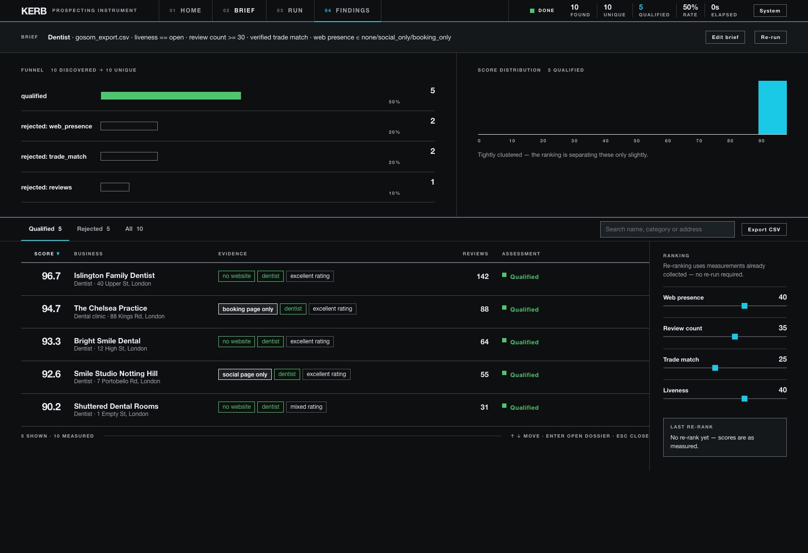
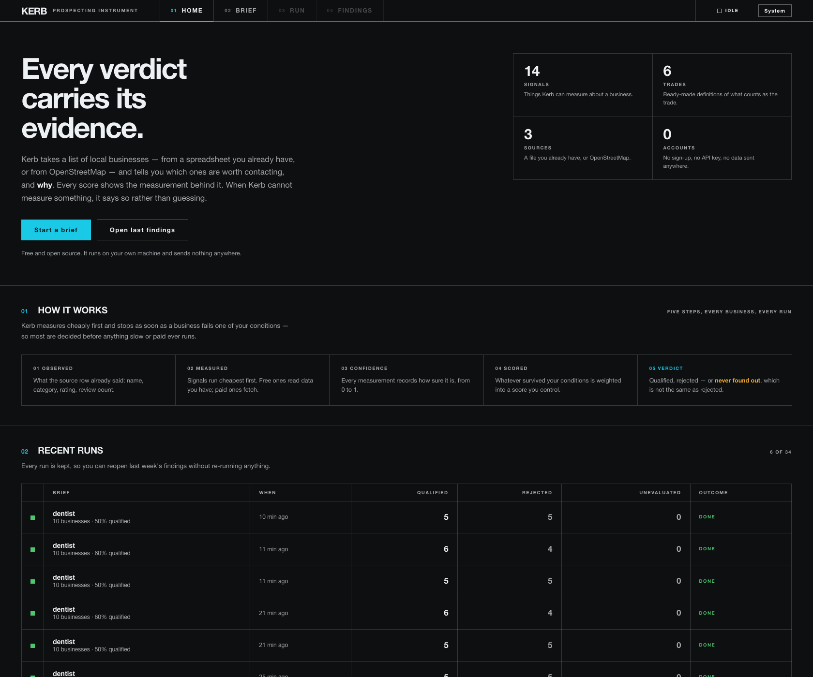
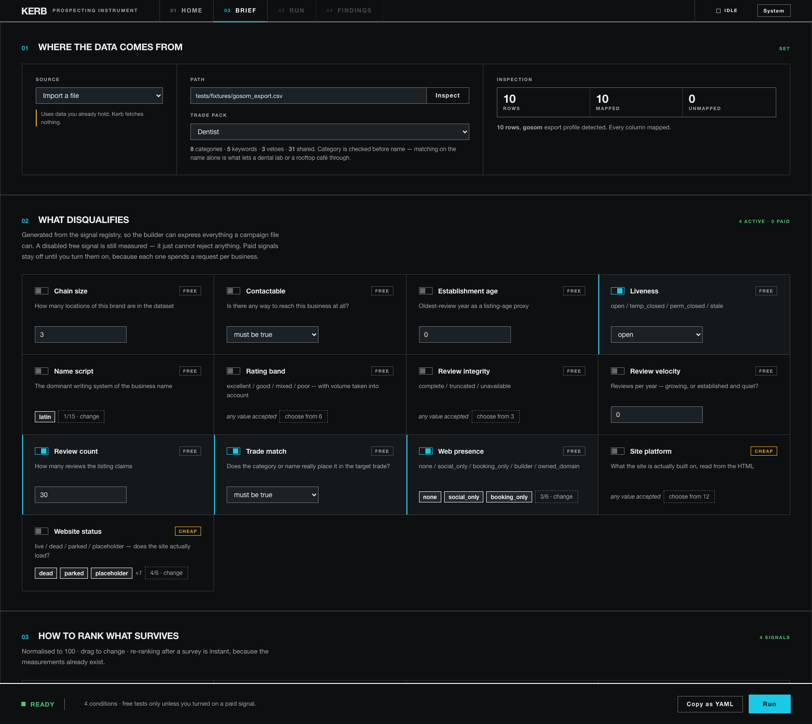
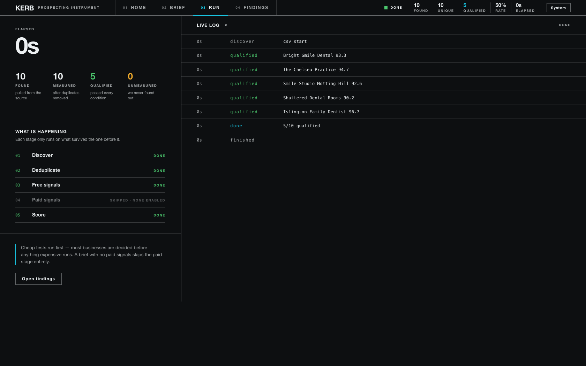

<div align="center">

# Kerb

**Type anything — bakeries in Leeds, tattoo studios in Berlin — and Kerb scrapes Google Maps for it,
then shows the evidence behind every score.**
No API key. No browser. No other scraper. And when it can't measure something, it says so.

[](LICENSE)
[](https://www.python.org/downloads/)
[](tests/)
[](pyproject.toml)
[](#legal)



</div>

---

Every Maps scraper hands you a spreadsheet. You still have to spend the afternoon
working out which of the 400 rows are worth a phone call — which ones are actually
in the trade, which closed in 2023, which are branches of a chain that already has
an agency.

Kerb is that afternoon, written down as a specification and executed in seconds,
**with the reasoning kept**.

```
  96.7  Mayvn Cafe               no website · cafe · excellent rating      4.9
  94.7  High Ground              social page only · cafe · excellent       4.8
  93.3  Blank Street Coffee      booking page only · cafe · excellent      4.6
```

Those chips are not decoration. They are the measurements that produced the score,
on the row, before you click anything.

---

## Three outcomes, not two

This is the part that makes Kerb different, so it goes first.

Most tools have two buckets: it matched, or it didn't. That is a lie by omission,
because a website check that *timed out* is not the same as a business with no
website — and if you conflate them, you will call people on the strength of a
network error.

| Outcome | What it means | What Kerb shows you |
|---|---|---|
| **Qualified** | Measured, and it passes every condition you set | The score, and every signal that contributed to it |
| **Rejected** | Measured, and it fails at least one condition | **Which** condition, with the value that failed it |
| **Never found out** | Kerb could not take the measurement | Said plainly, in its own tab, in amber — never counted as a rejection |

That third row is the entire architecture. A failed measurement is never a verdict
about a business.

> Kerb would rather tell you it doesn't know than quietly make something up.

---

## Where do I start?

| If you want to… | Go here |
|---|---|
| See it work in 60 seconds | [Quick start](#quick-start) |
| Scrape Google Maps for a trade | [Collecting from Google Maps](#collecting-from-google-maps) |
| Qualify a CSV you already have | [Quick start → a file you already have](#a-file-you-already-have) |
| Understand what it measures | [What it measures](#what-it-measures) |
| Write a brief by hand and schedule it | [The brief](#the-brief) |
| Not get blocked | [Staying unblocked](#staying-unblocked) |
| Know what it *can't* do | [What Kerb does not do](#what-kerb-does-not-do) |

---

## Quick start

```bash
pip install kerb[server]
kerb setup            # one-off: creates the browsing profile
kerb                  # opens the UI
```

That's it. No account, no API key, no Docker, no Chrome. Two dependencies:
`httpx` and `PyYAML`.

### Collecting from Google Maps

Pick **Google Maps** as the source, type any trade, list your places, press Run.

```bash
kerb setup --gl uk    # region matters: it decides which Google you get
kerb serve
```

Or headless, from a file:

```yaml
# cafes.yaml
name: cafes-islington
sources: [{id: gmaps}]
where:  {mode: paste, places: [Islington London]}
what:
  trade: cafes
  keywords: [cafe, coffee, espresso, roastery]   # Google knows these are
  categories: [cafe, coffee, espresso, roastery] # synonyms; a matcher doesn't
filters:
  - {signal: trade_match, op: "!=", value: false}
  - {signal: rating_band, op: in, value: [excellent, good]}
limits: {max_results: 200}
```

```bash
$ kerb run cafes.yaml --out leads.csv

  10 found, 10 unique, 9 qualified
    trade_match      rejected 1
  1.5s
  -> leads.csv (9 rows, csv)
```

### A file you already have

Already scraped Maps with something else? Kerb qualifies any CSV, JSON or JSONL:

```yaml
sources: [{id: csv, options: {path: exported.csv}}]
```

It auto-detects the column layout and tells you what it mapped and what it didn't.
The Google CID is the identity key, so businesses collected by Kerb and imported
from a file **deduplicate against each other for free**.

---

## Why not just use a scraper?

| A scraper gives you | Kerb gives you |
|---|---|
| 400 rows | 38 rows worth calling, and the 362 reasons |
| A name and a phone number | The measurement behind every score, with a confidence from 0 to 1 |
| Silence when a source fails | *"3 of 50 towns unreachable"* — before you act on a short list |
| Zero when it couldn't check | **"never found out"**, in its own bucket |
| The same 400 rows next week | Suppression: anyone you've dealt with is gone before a request is spent |
| A fixed set of fields | 14 signals, each with a cost tier — cheap tests run first, so most businesses are decided before anything slow does |

---

## The four screens

<table>
<tr>
<td width="50%"><br><b>Home</b> — what it does, your recent runs, and the five steps every business goes through.</td>
<td width="50%"><br><b>The brief</b> — every condition, generated from the signal registry. Reads itself back to you as a sentence.</td>
</tr>
<tr>
<td><br><b>The run</b> — live log, stage ladder, and an honest <i>skipped · none enabled</i> for tiers that never ran.</td>
<td><br><b>Findings</b> — evidence on the row, a funnel, a score distribution, and sliders that re-rank without re-running.</td>
</tr>
</table>

---

## What it measures

Fourteen signals, in **cost tiers**. Free ones read data already in hand. Paid ones
spend a network request per business and **stay off until you turn them on** —
Kerb never spends on your behalf.

The cleverness is the ordering: after each tier, Kerb tests your conditions against
what has been measured *so far*. The moment a business fails one, it stops. Most
never reach a paid tier at all.

<details>
<summary><b>All 14 signals</b> (click to open)</summary>

| Signal | Cost | What it asks | Values |
|---|---|---|---|
| `web_presence` | free | What kind of web presence is this, really? | none, social_only, booking_only, builder, owned_domain, unknown |
| `trade_match` | free | Does the category or name really place it in the target trade? | true / false |
| `reviews` | free | How many reviews does the listing claim? | number |
| `rating_band` | free | Which end of the market — with volume taken into account | excellent, good, mixed, poor, unrated |
| `liveness` | free | Is it still trading? | open, temp_closed, perm_closed, stale, unknown |
| `chain_size` | free | How many locations of this brand are in the dataset? | number |
| `contactable` | free | Is there *any* way to reach this business? | true / false |
| `review_velocity` | free | Reviews per year — growing, or established and quiet? | number |
| `review_integrity` | free | Is the review data complete, or truncated? | complete, truncated, unavailable |
| `establishment_age` | free | Oldest-review year, as a listing-age proxy | number |
| `name_script` | free | The dominant writing system of the name | latin, cyrillic, arabic, han, … |
| `site_status` | **cheap** | Does the website actually load? | live, dead, parked, placeholder, no_site |
| `site_platform` | **cheap** | What is it built on, read from the HTML | wix, squarespace, shopify, wordpress, … |
| `site_contact` | **cheap** | Contact details found on the site | text |

</details>

Each measurement is a `(value, confidence, evidence)` triple, and all three survive
into the dossier:

```
trade_match    dentist    conf 0.95    +25
   matched_category: Dentist
   rule: Dentist
   pack: trades/dentist@1
```

---

## Anything, anywhere

Six curated trade packs ship with Kerb — Dentist, HVAC, Medical, Painting, Roofing,
Vet — each a hand-written list of categories, name keywords and vetoes. They are
good. They are also six, and six is not the world.

**So type your own.** `hospitals`, `bakeries`, `tattoo studios`, `carpenters`.
Kerb stems it, matches it against each listing's category first and its name second,
and asks OpenStreetMap for the matching tag if that's your source.

```yaml
what: {trade: tattoo studios}
```

A curated pack is still better — it knows a *dental laboratory* is not a dentist.
A typed trade has no veto list, so check the **Rejected** tab after a run. The UI
says so, too.

---

## The brief

The UI is a builder for a YAML file, and nothing more. Everything the UI can express,
the file can — and the reverse, which is the harder promise to keep. Press
**Copy as YAML** and you have a scheduled job:

```yaml
name: dentists-north-london
sources: [{id: gmaps, options: {pause: 2}}]
where:   {mode: paste, places: [Islington London, Camden London]}
what:    {packs: [trades/dentist]}

filters:                                    # nine operators, not one
  - {signal: web_presence, op: in, value: [none, social_only, booking_only]}
  - {signal: reviews, op: ">=", value: 30}
  - {signal: chain_size, op: "<=", value: 3}
  - {signal: trade_match, op: "!=", value: false}

scoring:
  weights:
    reviews:      {weight: 35, scale: log, cap: 300}
    web_presence: {none: 40, social_only: 40, owned_domain: 0}
  normalise: true

limits:                                     # a collector without a ceiling is
  max_results: 500                          # how you wake up to a banned IP
  max_runtime_seconds: 1800
  max_requests: 2000
  workers: {discover: 3, profile: 3}

suppress:                                   # prospecting is weekly
  lists: [contacted.csv]                    # applied BEFORE anything is measured
  runs:  [88c16e73a314]                     # hides unchanged verdicts only
  after: 90d
```

Two things in there are worth calling out.

**Suppression is not deduplication.** A business you skipped last month because it
had a website, whose site is now dead, is the best lead in the file. Kerb applies
"seen before" *after* judging, and only when the verdict is unchanged. A changed
verdict is news.

**Re-ranking is free.** The measurements already exist, so moving a weight slider
re-scores in place without collecting anything again.

---

## Staying unblocked

Kerb is polite by construction, because the alternative is an address that stops
working:

- **Jittered pacing.** Nothing human requests every 2.000 seconds.
- **Persistent cooldown.** A block is recorded *to disk* and backs off harder each
  time — 15m, 30m, 1h, capped at 6h — decaying after a quiet day. The next run
  **refuses to start** while it's cooling, because walking back into a live block
  is how a short penalty becomes a long one. A clean run clears it.
- **It never fights a block.** No CAPTCHA solving, no evasion. A consent wall or a
  429 stops the run after *one* call and tells you.
- **Budgets count retries.** A budget that ignores them is not a budget.

```bash
kerb setup --check     # is the profile working? am I cooling down?
```

---

## Commands

| Command | Does |
|---|---|
| `kerb` | Opens the UI |
| `kerb setup` | Creates the browsing profile (`--check` to verify it) |
| `kerb run brief.yaml` | Runs headless, writes CSV / JSON / JSONL |
| `kerb estimate brief.yaml` | What it *would* do, without doing it |
| `kerb requalify <run>` | Re-judge a stored run with today's packs and rules — no re-collection |
| `kerb jobs` | Durable runs: what finished, what's left |
| `kerb doctor` | Checks the install, the profile, and stray processes |
| `kerb stop` | Kills everything Kerb started, and verifies it |

`kerb stop` exists because the tool this replaced leaked browser processes until a
disk filled. Kerb launches none — but it still checks.

---

## What Kerb does not do

Every project has these. Most hide them.

- **Review counts from Google Maps.** The search endpoint returns a rating but not a
  count. Kerb does **not** invent one: a guessed count silently changes every score.
  With `gmaps` as your source the UI blocks a review-count condition up front and
  offers `rating_band` instead, which *is* collected.
- **Synonyms.** A typed trade matches by substring, so `cafes` will not find
  "Coffee shop" until you add `coffee` to the keywords. Google knows they're
  synonyms; a string matcher doesn't.
- **CAPTCHAs and blocks.** Never solved, never bypassed. See above.
- **Personal data.** Kerb collects business listings — name, category, address,
  phone, website, rating. Not people.

---

## Contributing

The endpoint Kerb reads is undocumented, so the most valuable contribution is
usually a **field map fix**. When Google moves a field, one number changes:

```python
# kerb/sources/gmaps.py
FIELDS = {"cid": 10, "name": 11, "categories": 13, "address": 39, ...}
```

The map is data, not code, on purpose. And if the shape moves, `parse()` raises
`ShapeChanged` rather than returning an empty list — because a collector that
silently returns nothing is indistinguishable from a genuinely empty area, and
that is the exact dishonesty this project exists to remove.

```bash
git clone https://github.com/Startrekl/kerb && cd kerb
pip install -e ".[server]"
python3 -m pytest tests/ -q      # 170 tests, all offline
```

Tests are offline by design — one runs against a *real* captured response, trimmed
to a fixture, so a shape change breaks a test rather than a user's afternoon.

---

## Legal

Kerb reads public business listings the way the Maps site does. **This is against
Google's Terms of Service**, and the endpoint is undocumented and may change without
notice.

Kerb never solves a CAPTCHA and never works around a block — when it meets one it
stops, records a cooldown, and tells you. It collects business information, not
personal data. Nothing leaves your machine: there is no telemetry, no account and
no server but yours.

Use it at your own risk, and check what applies where you are.

## License

[MIT](LICENSE) © Sachin Gautam
